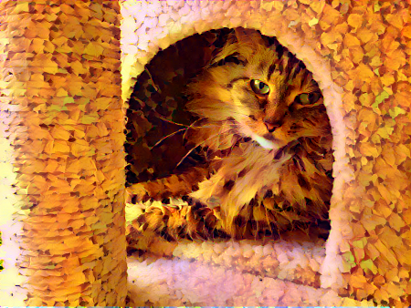
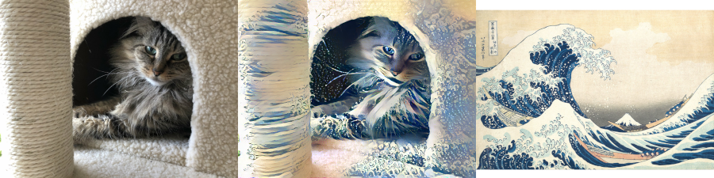
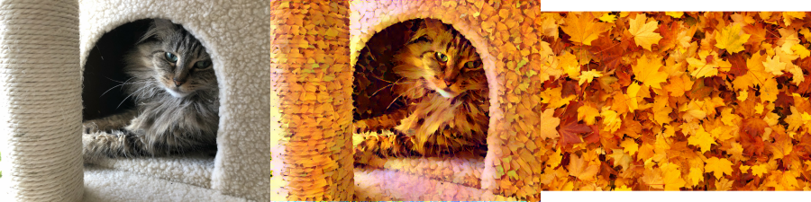
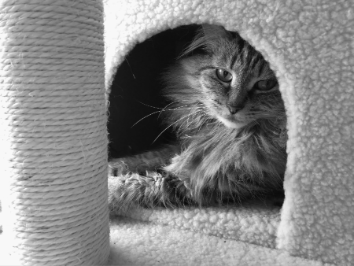
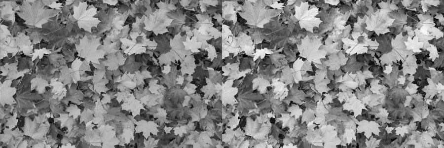
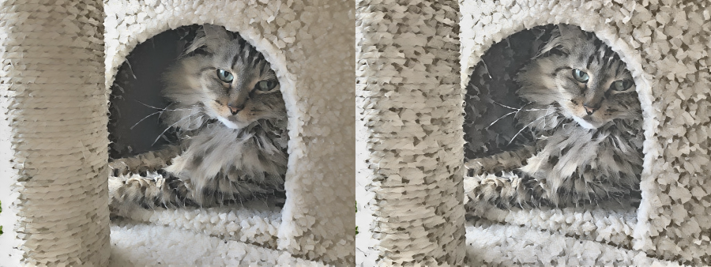

# Image style transfer #

Image style transfer has been around for a few years. This repository replicates the original technique, developed by Gatys et al, along with a couple of less well-known techniques. It requires TensorFlow, and runs much faster if CUDA is enabled (though the method is intrinsically expensive).

## Algorithm ##

Neural style transfer works by taking a content image and a style image and producing an output image containing the content of the first, rendered in the style of the second. The code in this repository uses an iterative method to do this, optimizing the image directly. More modern techniques instead train networks to output an image with the desired qualities. These techniques have largely supplanted the original algorithm, which is extremely slow, but generally use the same structure, with errors backpropagated through the output image into the network that produced it.

The style image is commonly a famous painting with a particularly striking style.

However, "style" is somewhat vague, and work preceding style transfer was generally about texture synthesis. It can sometimes be more useful to think of styles in terms of texture, when looking for what works. For example, a photograph of autumn leaves has great texture, which can create a striking photograph when transferred:

In fact, photographs can sometimes turn out better, because there are generally fewer strange artifacts due to jpeg compression or qualities that are intrinsic to the canvas instead of the image.

## Progressive image sizes ##

Because image size grows quadratically, it can be really expensive to produce large images. However, this can be avoided by creating small images, then upscaling them to larger ones and running the algorithm again. The pixellation which comes from rescaling will be eliminated in subsequent steps, as the fine detail tends to be replaced with a stylistically appropriate version.

## Luminance-only transfer ##

You might want to transfer an image's rough stylization while keeping the image's color intact. I'm surprised I haven't seen this technique more often, as it's applicable to every style transfer algorithm. To do this, an image is converted from RGB to YIQ format. The Y channel in YIQ is the image luminance, all color information is encoded in the I and Q channels.

Optionally, the image histograms of the luminance channels can be matched. This can result in better output if the style image has more or less variation than you want. On the left is the luminance-only version of the image with the leaves, which is somewhat muted (as most of the contrast was really in the color, not the saturation). On the right is that image, with its statistics matched to that of the cat photo, which has both bright textures and dark shadows.

If this is done with the content and style images, then transfer takes place on a grayscale version of the photos, without any color. The IQ channels which were extracted can then be mixed back into the final image, resulting in an image that shares the style of the style image, but with all color information coming from the content image. In this case, the histogram-matching was definitely worth it, as the picture with matching (right) turned out much better than the one without.

## Running it ##

To run the script on your own images, add tuples to the IMAGE_LIST variable in style_transfer.py and then run it in Python. The tuples should have three elements: the content file path, the style file path, and the initialization file path, in that order. Generally, the initialization should be the same as the content image pathname, but if you want to run more iterations on an already-transferred image, you may want to change it. If it's None, the algorithm will randomly initialize an image with noise and use that.

By default, the algorithm will perform normal style transfer, then luminance with and without histogram matching. The last three lines of style_transfer.py are where this occurs. If you don't want to do all three, comment out the unwanted calls there.
